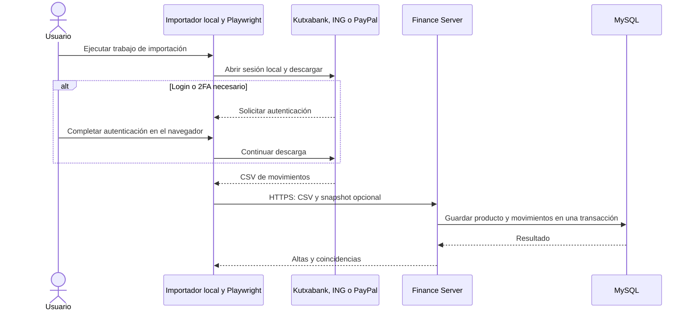

# Finance Suite 0.4.5

Persistencia con [Spring Data JPA](docs/RELEASE-0.4.5.md).

Identificación de varias tarjetas: [cambios y configuración](docs/RELEASE-0.4.4.md).

# Finance Suite 0.4.0 — importación local y análisis remoto

Dos aplicaciones Java 21 independientes, con arquitectura hexagonal:

| Aplicación | Dónde se ejecuta | Responsabilidad |
|---|---|---|
| `finance-importer` | Tu ordenador Linux con escritorio | Playwright, login/2FA, CSV local y envío autenticado |
| `finance-server` | Servidor local/remoto | Ingestión, MySQL, clasificación, REST y 18 herramientas MCP |
| `finance-domain` | Biblioteca compartida, no proceso | Modelo e invariantes comunes sin Spring ni Playwright |

El servidor no contiene Playwright ni perfiles bancarios. OpenClaw puede estar en una tercera máquina. El importador inicia la actualización desde tu ordenador; no hay orden remota/polling implementado ni se abren puertos en el importador. El servidor sigue disponible cuando tu ordenador está apagado.

**Estado de las integraciones:** ING incorpora adaptadores para XLS de cuenta y tarjeta de crédito y recorridos basados en las grabaciones aportadas; su navegación en vivo sigue pendiente de validar. Kutxabank y PayPal personal mantienen la base configurable y requieren selectores y formatos reales. El flujo completo con CSV normalizado está implementado y se prueba con datos ficticios. No se han usado tus cuentas ni instalado procesos en tu equipo.

## Flujo de importación



## Compilar

JDK 21 y Maven 3.9+:

```bash
mvn clean install
```

Genera dos ejecutables independientes:

- `finance-server/target/finance-server-0.4.0.jar`
- `finance-importer/target/finance-importer-0.4.0.jar`

La biblioteca de dominio queda dentro de cada JAR; no es necesario desplegar otro proceso. Los binarios generados no se incluyen en el ZIP. Docker puede compilar y ejecutar el servidor sin instalar JDK en esa máquina.

## 1. Servidor

```bash
cd finance-server
cp .env.example .env
chmod 600 .env
# Sustituye los 5 secretos por valores distintos: openssl rand -hex 24
docker compose up -d mysql
scripts/start-server.sh
```

Alternativa de contenedor:

```bash
cd finance-server
docker compose --profile server up --build -d
```

MySQL y HTTP se publican en loopback por defecto. Para una máquina distinta, configura HTTPS como se explica en `finance-server/docs/DEPLOYMENT.md`. El importador rechaza HTTP remoto y verifica el certificado del servidor; no implementa opciones para ignorarlo.

Roles:

| Usuario | Permisos |
|---|---|
| `reader` | Consultas REST y MCP |
| `importer` | Solo `POST /api/importer/products/{id}/batches` |
| `admin` | Gestión local de productos/clasificación/presupuestos y acceso completo |

No hay herramientas para pagos o transferencias bancarias. `importer` puede dar de alta un producto y enviar un saldo fechado junto a movimientos; no puede consultar datos, borrar productos ni reclasificar movimientos. Las credenciales de servicio son distintas de las credenciales bancarias.

## 2. Importador local

Copia el JAR del importador y su directorio de configuración/scripts al ordenador con escritorio. Para el ejemplo desde el código fuente:

```bash
cd finance-importer
cp .env.example .env
chmod 600 .env
cp config/jobs-example.yml config/jobs.yml
```

En `.env` define:

```dotenv
FINANCE_SERVER_URL=https://tu-servidor.example.com
FINANCE_IMPORTER_PASSWORD=el-secreto-importer-configurado-en-el-servidor
```

Solo para pruebas en la misma máquina: `http://127.0.0.1:8081`. El fichero es de shell: usa valores hexadecimales y no comandos. Este equipo no necesita MySQL, MCP, clave administrativa ni clave reader.

### Comprobar el envío sin entrar al banco

Con el servidor arrancado, ejecuta primero la cuenta y luego la tarjeta (por su relación):

```bash
scripts/start-importer.sh --spring.config.additional-location=file:./config/jobs.yml --finance.importer.job=demo-account
scripts/start-importer.sh --spring.config.additional-location=file:./config/jobs.yml --finance.importer.job=demo-card
```

Los trabajos demo apuntan a `../finance-server/examples`; si copias solo el importador, copia también esos ficheros y ajusta sus rutas. Son datos ficticios y fechas fijas. Repetirlos no duplica movimientos. Un snapshot con fecha anterior al saldo almacenado, o distinto importe en la misma fecha, se rechaza; para enviar solo movimientos elimina `product-file` del trabajo y registra el producto previamente.

### Descargar con Playwright

Tras `mvn install` en la raíz, instala Chromium **en el ordenador del importador**:

```bash
mvn -f finance-importer/pom.xml exec:java -Dexec.mainClass=com.microsoft.playwright.CLI -Dexec.args="install chromium"
```

Si faltan dependencias Linux, sigue las instrucciones oficiales de Playwright. Copia `config/browser-example.yml` a `config/browser.yml`, conserva solo los proveedores que vayas a usar y rellena URLs/selectores verificados. Crea los productos mediante administración o añade un `product-file` con snapshot real al trabajo local.

```bash
# Desde finance-importer:
scripts/start-importer.sh --spring.config.additional-location=file:./config/jobs.yml,file:./config/browser.yml --finance.importer.job=kutxabank-account
```

El navegador se abre en tu ordenador y tú completas el login/2FA. Cada entidad tiene perfil propio bajo `.private`. La descarga se valida localmente y se envía; tras confirmación de éxito se elimina. Si falla la validación o el envío, permanece en `.private` para revisión/reintento. El importador no elimina ficheros que le hayas proporcionado mediante `input-file`.

Puedes reintentar un archivo conservado creando un trabajo con `input-file: ./private/downloads/UUID.csv`. El servidor deduplica por `(productId, external_id)`. Si la conexión se corta tras recibir el servidor la petición, no puede saberse inmediatamente si fue aceptada: reintentar es seguro para las altas con identificador estable.

## 3. OpenClaw

En la máquina que ejecute el gateway coloca `finance-server/scripts`, `package.json` y `package-lock.json`. Configura el puente con el secreto reader y la URL HTTPS remota. Instrucciones en `finance-server/docs/OPENCLAW.md`. Puede estar en un equipo diferente del servidor y del importador.

Consultar no actualiza el banco: MCP usa datos ya importados. No hay scheduler ni avisos de actualización configurados. El importador es de ejecución única; una automatización futura debe ejecutarse en la sesión gráfica local y contemplar intervención por 2FA.

## Contrato de envío

`POST /api/importer/products/{id}/batches`, multipart:

- `file`: CSV normalizado UTF-8, `;`, hasta 10 MB / 50000 filas.
- `product`: JSON opcional con producto, proveedor y saldo fechado. Si se omite, el producto debe existir.

La alta/actualización de producto y sus movimientos forman una sola transacción. Un CSV inválido revierte el snapshot. El importador no puede cambiar tipo, proveedor, moneda o relación de un producto existente: esos cambios requieren administración. Para tarjetas, registra primero la cuenta vinculada. No se descubren saldos/productos automáticamente en las webs.

Cabecera CSV obligatoria:

```csv
external_id;date;amount;currency;description;merchant;category;kind;status
```

EUR, punto decimal, fechas ISO. Las reglas contables y las 18 herramientas se documentan en `finance-server/docs/OPERATIONS.md`. Las compras de crédito, liquidaciones, compras de débito duplicadas y movimientos PayPal se revisan para evitar doble conteo. Los datos financieros que OpenClaw use se envían al proveedor de su modelo si es cloud.

## Validación y límites

Resultados en `docs/VALIDATION.md`. Pruebas de arquitectura, cálculos, JPA/H2, permisos, ingestión atómica, transporte HTTP y conservación de descargas. La prueba de MySQL real necesita Docker y se omite si no está disponible. No se ha validado el navegador contra cuentas reales ni el despliegue en tu infraestructura.

Quedan pendientes las exportaciones anonimizadas de Kutxabank/ING/PayPal para adaptar sus formatos y verificar selectores. PayPal personal no depende de una API Business. No hay amortización revolving, inversiones externas, descubrimiento automático de productos ni sync desatendido garantizado. Perfiles privados requieren protección del equipo/disco; esta versión usa permisos POSIX y se entrega para Linux.

## Actualización 0.2.2: cuentas ING

Adaptador XLS real y recorrido Chrome de cuenta NÓMINA. Consulta
`finance-importer/README.md` y `finance-importer/config/ing-example.yml`.
La descarga requiere validación en el equipo del usuario. Ahora incluye el XLS
y el recorrido separado de tarjeta de crédito ING; no incluye tarjeta de débito.

## Organización del código 0.4.0

Los servicios están en `application.service`, los contratos en `application.port`
y los adaptadores/configuración en `infrastructure`. Los nombres Java y Maven
usan `com.finance`. Consulta [docs/ARCHITECTURE.md](docs/ARCHITECTURE.md) para
responsabilidades, estrategias y migración.

## Application traces

See [logging configuration and Lombok usage](docs/LOGGING.md). Set `FINANCE_LOG_LEVEL=DEBUG` to enable detailed application traces.

## Kutxabank

[Configuración de cuenta, recorrido y conversión XLS](docs/KUTXABANK.md).
